# Project & Resource Management (PRM) Tool - System Diagrams

This document contains the visual architectural specifications and Mermaid diagrams for the Project & Resource Management (PRM) Tool, categorized by:
1. **Use Case Diagrams**
2. **Entity-Relationship Diagram (ERD)**
3. **Process Flow / Activity Diagrams**
4. **Class Diagram**
5. **Sequence Diagrams**

---

## 1. Use Case Diagrams

To simplify readability and modular design, the use case diagrams are divided below by core system modules.

### 1.1. Authentication & Identity Management Module
This module handles login verification, user access restriction, force password updates, and administrative credentials management.

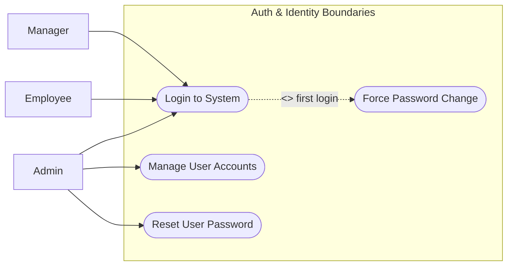
```mermaid
flowchart LR
    %% Actors
    Admin["Admin"]
    Manager["Manager"]
    Employee["Employee"]

    %% Use Cases
    subgraph AuthModule ["Auth & Identity Boundaries"]
        UC_Login(["Login to System"])
        UC_ForcePWD(["Force Password Change"])
        UC_ResetPWD(["Reset User Password"])
        UC_ManageUsers(["Manage User Accounts"])
    end

    %% Relations
    Admin --> UC_Login
    Admin --> UC_ManageUsers
    Admin --> UC_ResetPWD
    Manager --> UC_Login
    Employee --> UC_Login
    UC_Login -.-> |"<<include>> first login"| UC_ForcePWD
```

### 1.2. Admin Management Module
Used by the Administrator to manage the corporate core data—employees, profiles, user directory, system constraints, skills, and projects.

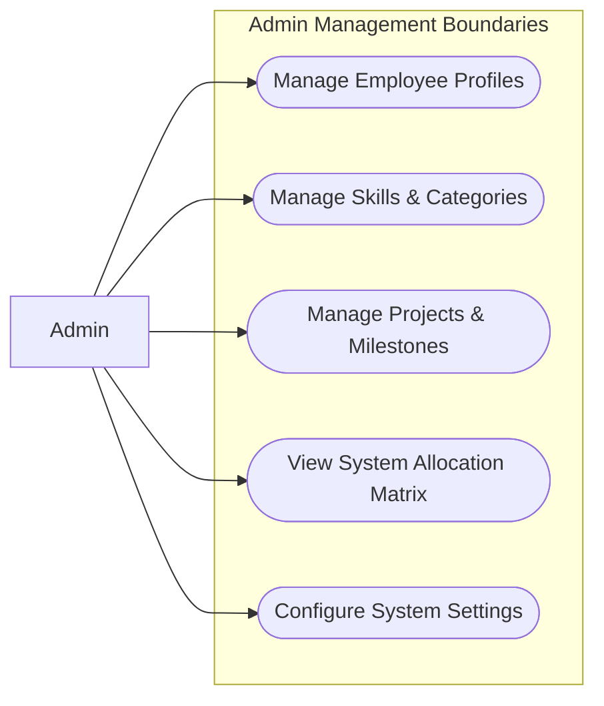
```mermaid
flowchart LR
    %% Actors
    Admin["Admin"]

    %% Use Cases
    subgraph AdminOps ["Admin Management Boundaries"]
        UC_ManageEmployees(["Manage Employee Profiles"])
        UC_ManageSkills(["Manage Skills & Categories"])
        UC_ManageProjects(["Manage Projects & Milestones"])
        UC_ViewAllocations(["View System Allocation Matrix"])
        UC_SysConfig(["Configure System Settings"])
    end

    %% Relations
    Admin --> UC_ManageEmployees
    Admin --> UC_ManageSkills
    Admin --> UC_ManageProjects
    Admin --> UC_ViewAllocations
    Admin --> UC_SysConfig
```

### 1.3. Manager Planning Module
Empowers project managers to search and allocate resources, track milestones, view team hours, and utilize AI intelligence for talent matching and risk alerts.

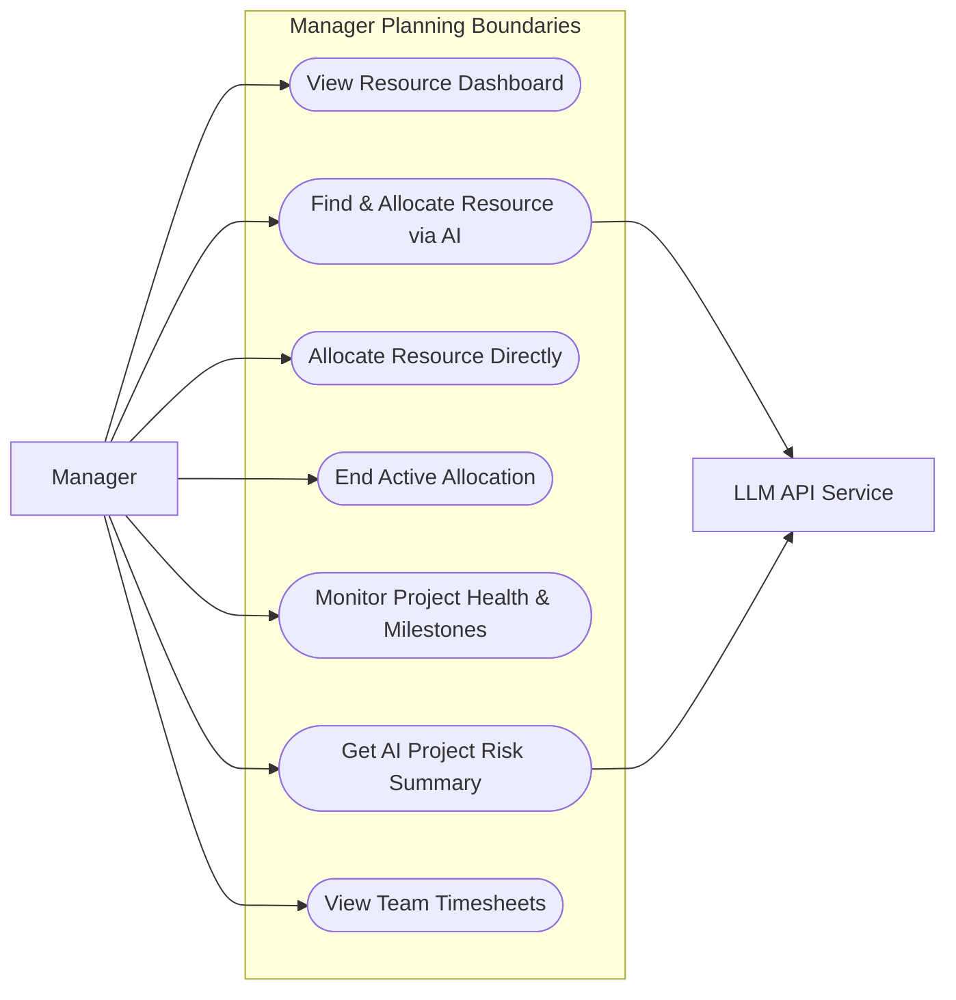
```mermaid
flowchart LR
    %% Actors
    Manager["Manager"]
    LLM["LLM API Service"]

    %% Use Cases
    subgraph ManagerOps ["Manager Planning Boundaries"]
        UC_Dashboard(["View Resource Dashboard"])
        UC_AI_Alloc(["Find & Allocate Resource via AI"])
        UC_Direct_Alloc(["Allocate Resource Directly"])
        UC_End_Alloc(["End Active Allocation"])
        UC_ViewProjHealth(["Monitor Project Health & Milestones"])
        UC_GetRiskSummary(["Get AI Project Risk Summary"])
        UC_ViewTeamTS(["View Team Timesheets"])
    end

    %% Relations
    Manager --> UC_Dashboard
    Manager --> UC_AI_Alloc
    Manager --> UC_Direct_Alloc
    Manager --> UC_End_Alloc
    Manager --> UC_ViewProjHealth
    Manager --> UC_GetRiskSummary
    Manager --> UC_ViewTeamTS

    UC_AI_Alloc --> LLM
    UC_GetRiskSummary --> LLM
```

### 1.4. Employee Self-Service Module
Provides employee portals to log hours against allocated projects, select activity tags, and view individual logs.

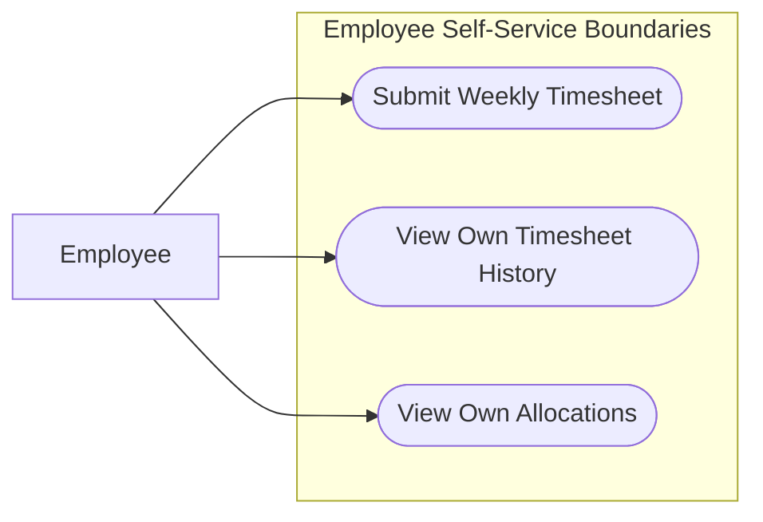
```mermaid
flowchart LR
    %% Actors
    Employee["Employee"]

    %% Use Cases
    subgraph EmployeeOps ["Employee Self-Service Boundaries"]
        UC_SubmitTS(["Submit Weekly Timesheet"])
        UC_ViewOwnTS(["View Own Timesheet History"])
        UC_ViewOwnAlloc(["View Own Allocations"])
    end

    %% Relations
    Employee --> UC_SubmitTS
    Employee --> UC_ViewOwnTS
    Employee --> UC_ViewOwnAlloc
```

### 1.5. Core Engine & Background Processes
Handles offline scheduler computations that run periodically to adjust statuses and compute health signals.

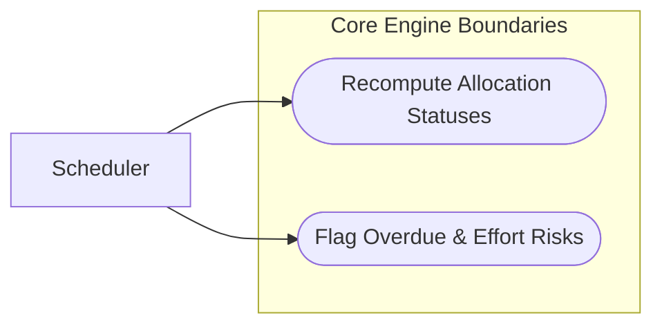
```mermaid
flowchart LR
    %% Actors
    Scheduler["Scheduler"]

    %% Use Cases
    subgraph CoreEngine ["Core Engine Boundaries"]
        UC_CalcUtil(["Recompute Allocation Statuses"])
        UC_FlagHealth(["Flag Overdue & Effort Risks"])
    end

    %% Relations
    Scheduler --> UC_CalcUtil
    Scheduler --> UC_FlagHealth
```

---

## 2. Entity-Relationship Diagram (ERD)

This physical database model details the database structures, field types, primary/foreign keys, and constraints representing the system state.

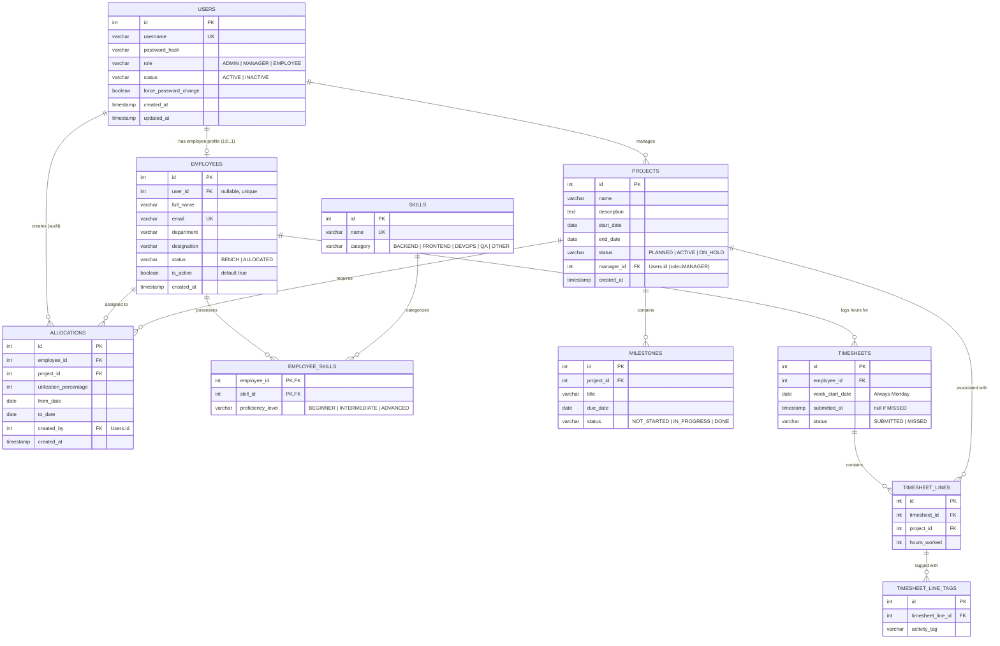
```mermaid
erDiagram
    USERS ||--o| EMPLOYEES : "has employee profile (1:0..1)"
    USERS ||--o{ PROJECTS : "manages"
    USERS ||--o{ ALLOCATIONS : "creates (audit)"
    
    EMPLOYEES ||--o{ EMPLOYEE_SKILLS : "possesses"
    SKILLS ||--o{ EMPLOYEE_SKILLS : "categorizes"
    
    EMPLOYEES ||--o{ ALLOCATIONS : "assigned to"
    PROJECTS ||--o{ ALLOCATIONS : "requires"
    
    PROJECTS ||--o{ MILESTONES : "contains"
    
    EMPLOYEES ||--o{ TIMESHEETS : "logs hours for"
    TIMESHEETS ||--o{ TIMESHEET_LINES : "contains"
    PROJECTS ||--o{ TIMESHEET_LINES : "associated with"
    TIMESHEET_LINES ||--o{ TIMESHEET_LINE_TAGS : "tagged with"

    USERS {
        int id PK
        varchar username UK
        varchar password_hash
        varchar role "ADMIN | MANAGER | EMPLOYEE"
        varchar status "ACTIVE | INACTIVE"
        boolean force_password_change
        timestamp created_at
        timestamp updated_at
    }

    EMPLOYEES {
        int id PK
        int user_id FK "nullable, unique"
        varchar full_name
        varchar email UK
        varchar department
        varchar designation
        varchar status "BENCH | ALLOCATED"
        boolean is_active "default true"
        timestamp created_at
    }

    SKILLS {
        int id PK
        varchar name UK
        varchar category "BACKEND | FRONTEND | DEVOPS | QA | OTHER"
    }

    EMPLOYEE_SKILLS {
        int employee_id PK, FK
        int skill_id PK, FK
        varchar proficiency_level "BEGINNER | INTERMEDIATE | ADVANCED"
    }

    PROJECTS {
        int id PK
        varchar name
        text description
        date start_date
        date end_date
        varchar status "PLANNED | ACTIVE | ON_HOLD"
        int manager_id FK "Users.id (role=MANAGER)"
        timestamp created_at
    }

    MILESTONES {
        int id PK
        int project_id FK
        varchar title
        date due_date
        varchar status "NOT_STARTED | IN_PROGRESS | DONE"
    }

    ALLOCATIONS {
        int id PK
        int employee_id FK
        int project_id FK
        int utilization_percentage
        date from_date
        date to_date
        int created_by FK "Users.id"
        timestamp created_at
    }

    TIMESHEETS {
        int id PK
        int employee_id FK
        date week_start_date "Always Monday"
        timestamp submitted_at "null if MISSED"
        varchar status "SUBMITTED | MISSED"
    }

    TIMESHEET_LINES {
        int id PK
        int timesheet_id FK
        int project_id FK
        int hours_worked
    }

    TIMESHEET_LINE_TAGS {
        int id PK
        int timesheet_line_id FK
        varchar activity_tag
    }
```

---

## 3. Process Flow / Activity Diagrams

The activity flows below describe the step-by-step logic, input processing, and validation paths for each module.

### 3.1. Authentication & User Management Flows

#### 3.1.1. Login & Forced Password Change Flow
Ensures password complexity rules are checked on first-time logins.

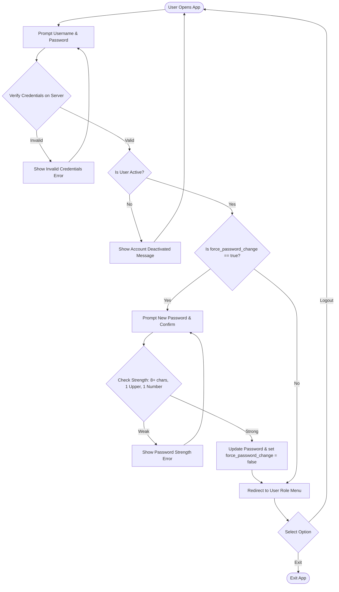
```mermaid
flowchart TD
    Start([User Opens App]) --> InputCreds[Prompt Username & Password]
    InputCreds --> ValidateCreds{Verify Credentials on Server}
    
    ValidateCreds -- Invalid --> ShowErr[Show Invalid Credentials Error]
    ShowErr --> InputCreds
    
    ValidateCreds -- Valid --> CheckActive{Is User Active?}
    CheckActive -- No --> ShowBlocked[Show Account Deactivated Message]
    ShowBlocked --> Start
    
    CheckActive -- Yes --> ForcePwdChange{Is force_password_change == true?}
    
    ForcePwdChange -- Yes --> PromptNewPwd[Prompt New Password & Confirm]
    PromptNewPwd --> ValidatePwdStrength{Check Strength: 8+ chars, 1 Upper, 1 Number}
    
    ValidatePwdStrength -- Weak --> ShowPwdErr[Show Password Strength Error]
    ShowPwdErr --> PromptNewPwd
    
    ValidatePwdStrength -- Strong --> SavePwd[Update Password & set force_password_change = false]
    SavePwd --> RouteMenu[Redirect to User Role Menu]
    
    ForcePwdChange -- No --> RouteMenu
    
    RouteMenu --> MenuOptions{Select Option}
    MenuOptions -- Logout --> Start
    MenuOptions -- Exit --> End([Exit App])
```

#### 3.1.2. User Account Operations Flow
Describes administrative control of accounts (Creation, Password Reset, Deactivation, Reactivation).

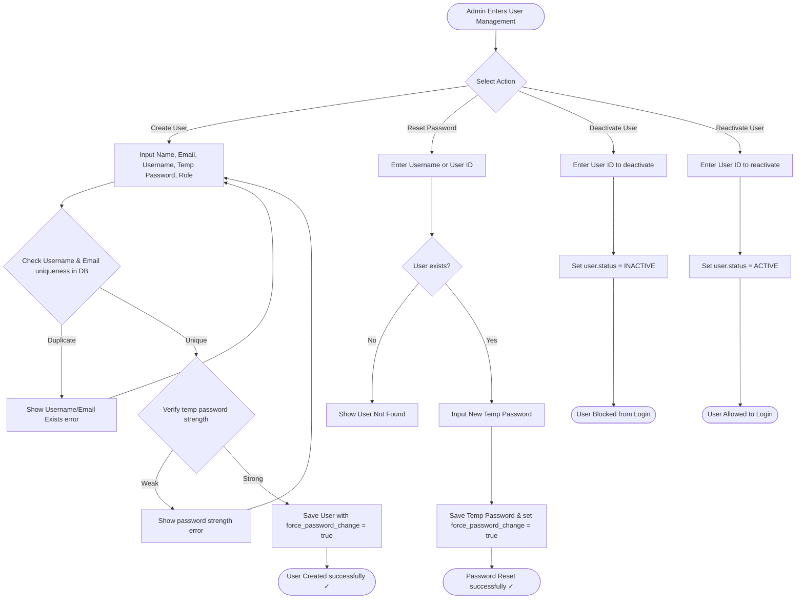
```mermaid
flowchart TD
    Start([Admin Enters User Management]) --> SelectAction{Select Action}
    
    %% Create User
    SelectAction -- Create User --> InputDetails[Input Name, Email, Username, Temp Password, Role]
    InputDetails --> ValidateUniqueness{Check Username & Email uniqueness in DB}
    ValidateUniqueness -- Duplicate --> ShowDupErr[Show Username/Email Exists error]
    ShowDupErr --> InputDetails
    ValidateUniqueness -- Unique --> ValidateTempPwd{Verify temp password strength}
    ValidateTempPwd -- Weak --> ShowWeakErr[Show password strength error]
    ShowWeakErr --> InputDetails
    ValidateTempPwd -- Strong --> SaveUser[Save User with force_password_change = true]
    SaveUser --> EndCreate([User Created successfully ✓])
    
    %% Password Reset
    SelectAction -- Reset Password --> SearchUser[Enter Username or User ID]
    SearchUser --> VerifyExist{User exists?}
    VerifyExist -- No --> ShowUserErr[Show User Not Found]
    VerifyExist -- Yes --> InputNewTemp[Input New Temp Password]
    InputNewTemp --> SaveTempPwd[Save Temp Password & set force_password_change = true]
    SaveTempPwd --> EndReset([Password Reset successfully ✓])
    
    %% User Deactivation/Reactivation
    SelectAction -- Deactivate User --> EnterDeactId[Enter User ID to deactivate]
    EnterDeactId --> DBDeact[Set user.status = INACTIVE]
    DBDeact --> EndDeact([User Blocked from Login])
    
    SelectAction -- Reactivate User --> EnterReactId[Enter User ID to reactivate]
    EnterReactId --> DBReact[Set user.status = ACTIVE]
    DBReact --> EndReact([User Allowed to Login])
```

---

### 3.2. Admin Operations & Resource Profiling Flows

#### 3.2.1. Employee Profiling & Skill Setup Flow
Handles employee registration and linking user accounts with skill levels.

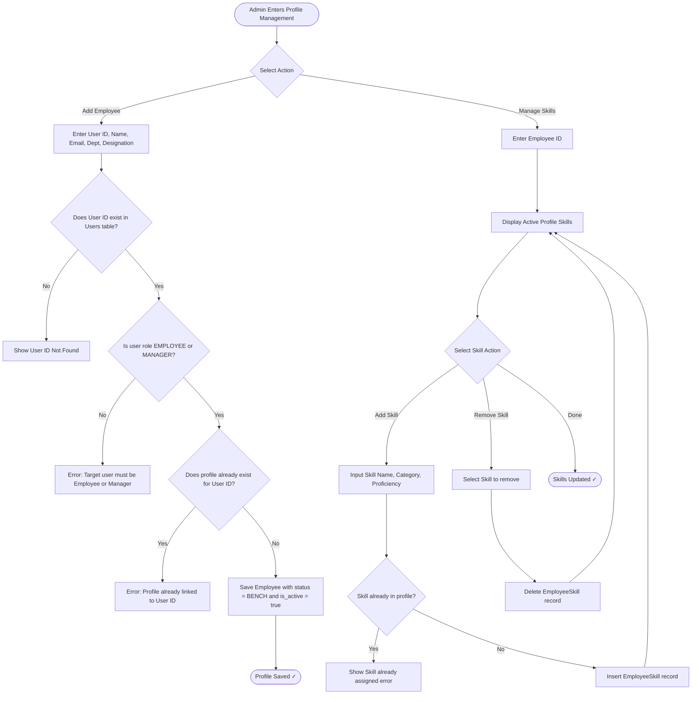
```mermaid
flowchart TD
    Start([Admin Enters Profile Management]) --> SelectAction{Select Action}
    
    %% Add Employee Profile
    SelectAction -- Add Employee --> InputEmpDetails[Enter User ID, Name, Email, Dept, Designation]
    InputEmpDetails --> CheckUserExist{Does User ID exist in Users table?}
    CheckUserExist -- No --> ShowUserNoExist[Show User ID Not Found]
    CheckUserExist -- Yes --> CheckRole{Is user role EMPLOYEE or MANAGER?}
    CheckRole -- No --> ShowRoleErr[Error: Target user must be Employee or Manager]
    CheckRole -- Yes --> CheckDuplicateProfile{Does profile already exist for User ID?}
    CheckDuplicateProfile -- Yes --> ShowProfileErr[Error: Profile already linked to User ID]
    CheckDuplicateProfile -- No --> SaveEmpProfile[Save Employee with status = BENCH and is_active = true]
    SaveEmpProfile --> EndAdd([Profile Saved ✓])

    %% Manage Skills
    SelectAction -- Manage Skills --> EnterEmpId[Enter Employee ID]
    EnterEmpId --> ViewSkills[Display Active Profile Skills]
    ViewSkills --> SelectSkillAction{Select Skill Action}
    
    SelectSkillAction -- Add Skill --> InputSkill[Input Skill Name, Category, Proficiency]
    InputSkill --> CheckSkillExists{Skill already in profile?}
    CheckSkillExists -- Yes --> ShowSkillDup[Show Skill already assigned error]
    CheckSkillExists -- No --> SaveSkill[Insert EmployeeSkill record]
    SaveSkill --> ViewSkills

    SelectSkillAction -- Remove Skill --> SelectExistSkill[Select Skill to remove]
    SelectExistSkill --> DeleteSkill[Delete EmployeeSkill record]
    DeleteSkill --> ViewSkills
    
    SelectSkillAction -- Done --> EndSkills([Skills Updated ✓])
```

#### 3.2.2. Employee Deactivation Flow
Specifies the safety rules to end active allocations today and block logins while preserving database history.

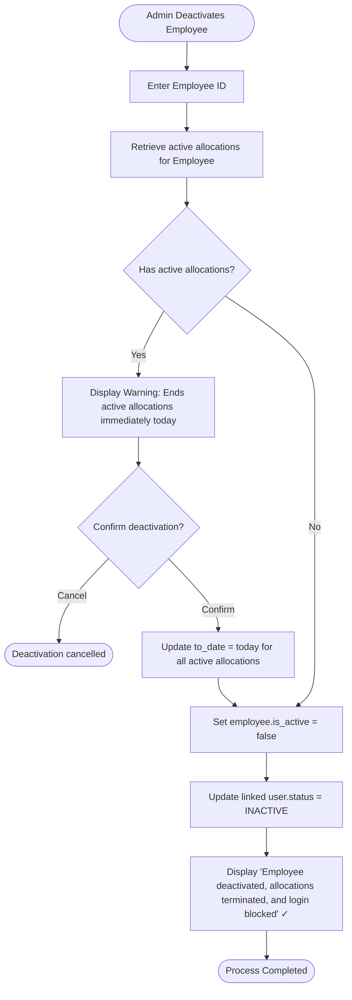
```mermaid
flowchart TD
    Start([Admin Deactivates Employee]) --> EnterEmpId[Enter Employee ID]
    EnterEmpId --> FetchAlloc[Retrieve active allocations for Employee]
    FetchAlloc --> CheckAlloc{Has active allocations?}
    
    CheckAlloc -- Yes --> WarnAdmin[Display Warning: Ends active allocations immediately today]
    WarnAdmin --> ConfirmDeact{Confirm deactivation?}
    ConfirmDeact -- Cancel --> EndDeact([Deactivation cancelled])
    ConfirmDeact -- Confirm --> EndActiveAllocs[Update to_date = today for all active allocations]
    EndActiveAllocs --> SetInactive
    
    CheckAlloc -- No --> SetInactive[Set employee.is_active = false]
    SetInactive --> BlockUser[Update linked user.status = INACTIVE]
    BlockUser --> SuccessMsg[Display 'Employee deactivated, allocations terminated, and login blocked' ✓]
    SuccessMsg --> EndDone([Process Completed])
```

#### 3.2.3. Project Setup & Milestone Management Flow
Processes milestone updates alongside projects.

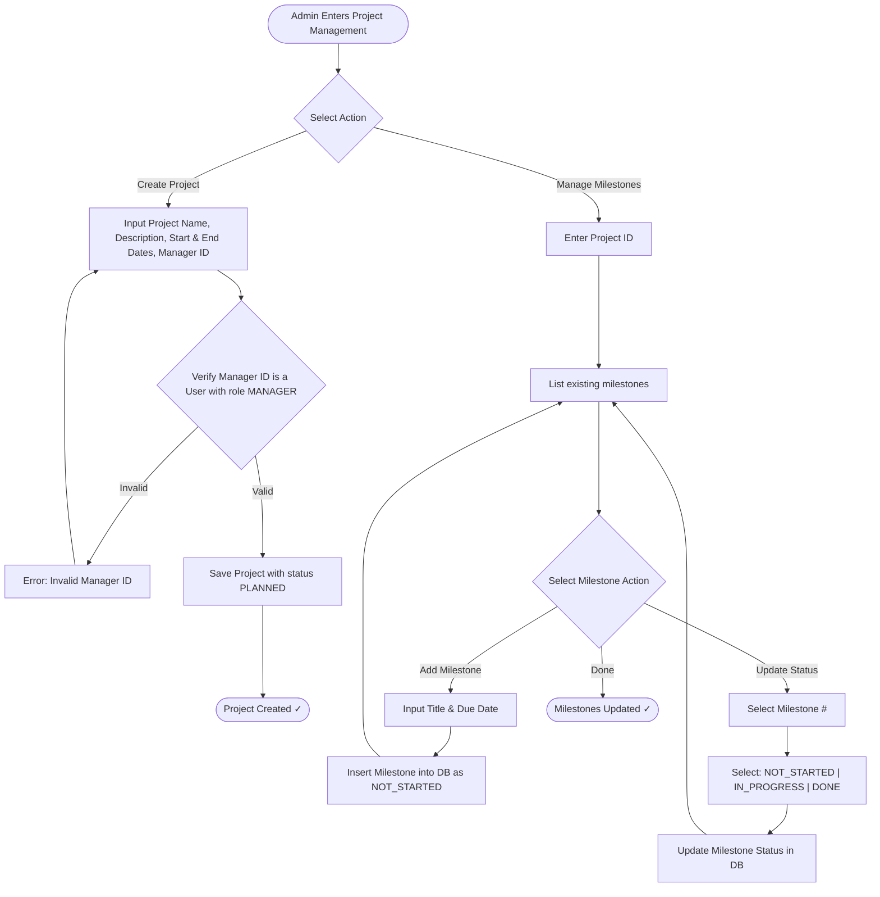
```mermaid
flowchart TD
    Start([Admin Enters Project Management]) --> SelectAction{Select Action}
    
    %% Create Project
    SelectAction -- Create Project --> InputProj[Input Project Name, Description, Start & End Dates, Manager ID]
    InputProj --> CheckMgr{Verify Manager ID is a User with role MANAGER}
    CheckMgr -- Invalid --> ShowMgrErr[Error: Invalid Manager ID]
    ShowMgrErr --> InputProj
    CheckMgr -- Valid --> SaveProj[Save Project with status PLANNED]
    SaveProj --> EndProj([Project Created ✓])
    
    %% Milestone Management
    SelectAction -- Manage Milestones --> EnterProjId[Enter Project ID]
    EnterProjId --> DisplayMilestones[List existing milestones]
    DisplayMilestones --> SelectMilestoneAction{Select Milestone Action}
    
    SelectMilestoneAction -- Add Milestone --> InputMilestone[Input Title & Due Date]
    InputMilestone --> SaveMilestone[Insert Milestone into DB as NOT_STARTED]
    SaveMilestone --> DisplayMilestones
    
    SelectMilestoneAction -- Update Status --> SelectMilestone[Select Milestone #]
    SelectMilestone --> PromptMilestoneStatus["Select: NOT_STARTED | IN_PROGRESS | DONE"]
    PromptMilestoneStatus --> SaveMilestoneStatus[Update Milestone Status in DB]
    SaveMilestoneStatus --> DisplayMilestones
    
    SelectMilestoneAction -- Done --> EndMilestones([Milestones Updated ✓])
```

---

### 3.3. Manager Resource Allocation Flows

#### 3.3.1. AI-Assisted Resource Allocation Flow
Shows candidate capability filtering, LLM suggestions, and utilization limit validation.

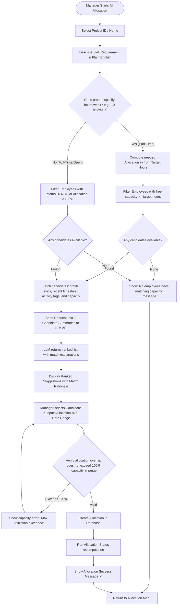
```mermaid
flowchart TD
    Start([Manager Starts AI Allocation]) --> SelectProj[Select Project ID / Name]
    SelectProj --> InputReq[Describe Skill Requirement in Plain English]
    
    InputReq --> ParseReq{Does prompt specify hours/week? e.g. '10 hrs/week'}
    
    %% Part-time filtering
    ParseReq -- Yes (Part-Time) --> CalcTargetPct[Compute needed Allocation % from Target Hours]
    CalcTargetPct --> FilterPartTime[Filter Employees with free capacity >= target hours]
    FilterPartTime --> PCheckAvailability{Any candidates available?}
    
    %% Full-time filtering
    ParseReq -- No (Full-Time/Open) --> FilterFullTime[Filter Employees with status BENCH or Allocation < 100%]
    FilterFullTime --> FCheckAvailability{Any candidates available?}
    
    %% Handle no availability
    PCheckAvailability -- None --> ShowFailMsg[Show 'No employees have matching capacity' message]
    FCheckAvailability -- None --> ShowFailMsg
    ShowFailMsg --> ReturnMenu[Return to Allocation Menu]
    
    %% LLM Analysis
    PCheckAvailability -- Found --> CallLLM[Fetch candidates' profile skills, recent timesheet activity tags, and capacity]
    FCheckAvailability -- Found --> CallLLM
    
    CallLLM --> SendToAI[Send Request text + Candidate Summaries to LLM API]
    SendToAI --> LLMResponse[LLM returns ranked list with match explanations]
    
    %% Allocation Selection & Validation
    LLMResponse --> ShowMatches[Display Ranked Suggestions with Match Rationale]
    ShowMatches --> PromptSelect[Manager selects Candidate & inputs Allocation % & Date Range]
    
    PromptSelect --> ServerVal{Verify allocation overlap does not exceed 100% capacity in range}
    ServerVal -- Exceeds 100% --> ShowOverlapErr[Show capacity error: 'Max utilization exceeded']
    ShowOverlapErr --> PromptSelect
    
    ServerVal -- Valid --> SaveAllocation[Create Allocation in Database]
    SaveAllocation --> TriggerScheduler[Run Allocation Status recomputation]
    TriggerScheduler --> Success[Show Allocation Success Message ✓]
    Success --> ReturnMenu
```

#### 3.3.2. Direct Allocation & Allocation Termination Flow
Direct planning flows and allocation release paths.

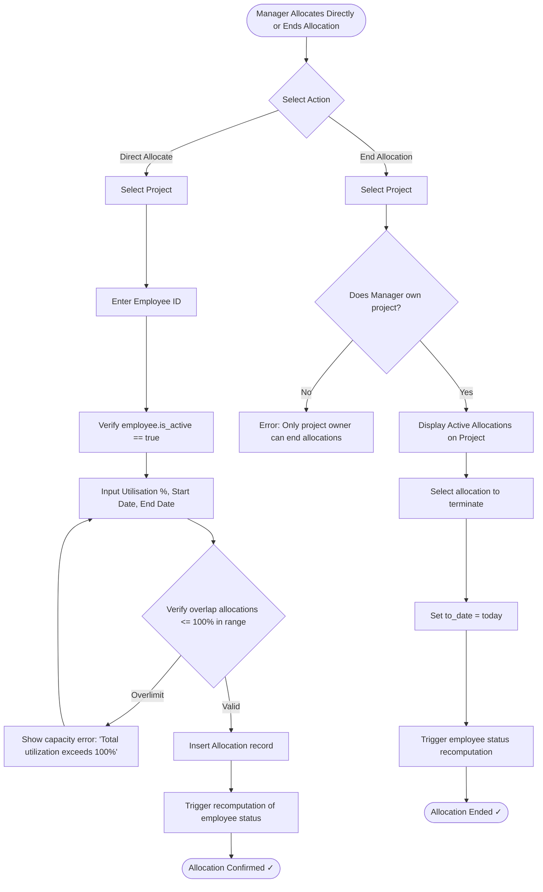
```mermaid
flowchart TD
    Start([Manager Allocates Directly or Ends Allocation]) --> SelectAction{Select Action}
    
    %% Direct Allocation
    SelectAction -- Direct Allocate --> SelectProj[Select Project]
    SelectProj --> SelectEmp[Enter Employee ID]
    SelectEmp --> GetCurrentUtil[Verify employee.is_active == true]
    GetCurrentUtil --> InputAllocDetails[Input Utilisation %, Start Date, End Date]
    InputAllocDetails --> ServerVal{Verify overlap allocations <= 100% in range}
    ServerVal -- Overlimit --> ShowUtilErr[Show capacity error: 'Total utilization exceeds 100%']
    ShowUtilErr --> InputAllocDetails
    ServerVal -- Valid --> SaveAlloc[Insert Allocation record]
    SaveAlloc --> TriggerRecomputation[Trigger recomputation of employee status]
    TriggerRecomputation --> EndAllocDone([Allocation Confirmed ✓])

    %% End Allocation
    SelectAction -- End Allocation --> SelectEndProj[Select Project]
    SelectEndProj --> VerifyOwnership{Does Manager own project?}
    VerifyOwnership -- No --> ShowOwnerErr[Error: Only project owner can end allocations]
    VerifyOwnership -- Yes --> ShowActiveAllocs[Display Active Allocations on Project]
    ShowActiveAllocs --> SelectAlloc[Select allocation to terminate]
    SelectAlloc --> EndNow[Set to_date = today]
    EndNow --> TriggerRecomp[Trigger employee status recomputation]
    TriggerRecomp --> EndTermDone([Allocation Ended ✓])
```

---

### 3.4. Employee Self-Service Flow

#### 3.4.1. Timesheet Submission Flow
Walks through timesheet entries, limit check validations, and activity tags processing.

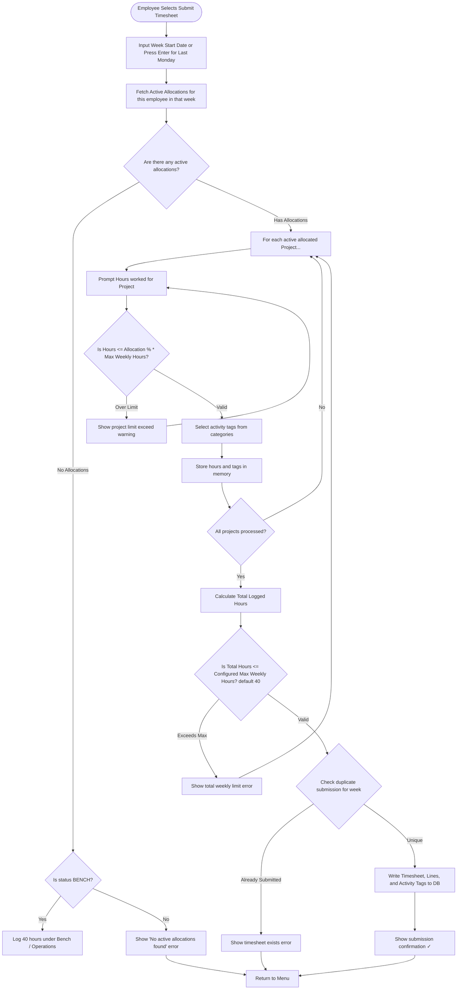
```mermaid
flowchart TD
    Start([Employee Selects Submit Timesheet]) --> PromptWeek[Input Week Start Date or Press Enter for Last Monday]
    PromptWeek --> GetAllocations[Fetch Active Allocations for this employee in that week]
    
    GetAllocations --> CheckAllocCount{Are there any active allocations?}
    CheckAllocCount -- No Allocations --> OnBench{Is status BENCH?}
    OnBench -- Yes --> LogBenchHrs[Log 40 hours under Bench / Operations]
    OnBench -- No --> ShowNoAllocErr[Show 'No active allocations found' error]
    ShowNoAllocErr --> ReturnMenu[Return to Menu]
    
    CheckAllocCount -- Has Allocations --> LoopProjects[For each active allocated Project...]
    
    LoopProjects --> PromptHrs[Prompt Hours worked for Project]
    PromptHrs --> ValidateProjHrs{Is Hours <= Allocation % * Max Weekly Hours?}
    ValidateProjHrs -- Over Limit --> ShowLimitErr[Show project limit exceed warning]
    ShowLimitErr --> PromptHrs
    
    ValidateProjHrs -- Valid --> PromptTags[Select activity tags from categories]
    PromptTags --> SaveLine[Store hours and tags in memory]
    
    SaveLine --> CheckAllDone{All projects processed?}
    CheckAllDone -- No --> LoopProjects
    
    CheckAllDone -- Yes --> SumHours[Calculate Total Logged Hours]
    SumHours --> ValidateTotalHrs{Is Total Hours <= Configured Max Weekly Hours? default 40}
    
    ValidateTotalHrs -- Exceeds Max --> ShowTotalErr[Show total weekly limit error]
    ShowTotalErr --> LoopProjects
    
    ValidateTotalHrs -- Valid --> CheckDuplicate{Check duplicate submission for week}
    CheckDuplicate -- Already Submitted --> ShowDupErr[Show timesheet exists error]
    ShowDupErr --> ReturnMenu
    
    CheckDuplicate -- Unique --> SaveDB[Write Timesheet, Lines, and Activity Tags to DB]
    SaveDB --> ShowSuccess[Show submission confirmation ✓]
    ShowSuccess --> ReturnMenu
```

---

### 3.5. Background Engine & Process Flow

#### 3.5.1. Background Scheduler Flow
Periodic status recomputation and project health risk analysis.

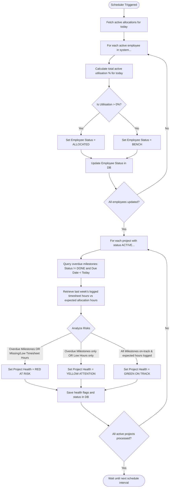
```mermaid
flowchart TD
    Start([Scheduler Triggered]) --> GetActiveAllocations[Fetch active allocations for today]
    
    %% Employee Status Recomputation
    GetActiveAllocations --> LoopEmployees[For each active employee in system...]
    LoopEmployees --> SumUtil[Calculate total active utilisation % for today]
    SumUtil --> CheckUtil{Is Utilisation > 0%?}
    CheckUtil -- Yes --> SetAllocated[Set Employee Status = ALLOCATED]
    CheckUtil -- No --> SetBench[Set Employee Status = BENCH]
    SetAllocated --> UpdateEmpStatus[Update Employee Status in DB]
    SetBench --> UpdateEmpStatus
    
    UpdateEmpStatus --> CheckAllEmpDone{All employees updated?}
    CheckAllEmpDone -- No --> LoopEmployees
    
    %% Project Health Computation
    CheckAllEmpDone -- Yes --> LoopProjects[For each project with status ACTIVE...]
    LoopProjects --> CheckOverdueMilestones[Query overdue milestones: Status != DONE and Due Date < Today]
    
    CheckOverdueMilestones --> CheckTimesheets[Retrieve last week's logged timesheet hours vs expected allocation hours]
    CheckTimesheets --> EvaluateRisks{Analyze Risks}
    
    EvaluateRisks -- Overdue Milestones OR Missing/Low Timesheet Hours --> MarkRisk[Set Project Health = RED AT RISK]
    EvaluateRisks -- Overdue Milestones only OR Low Hours only --> MarkAttention[Set Project Health = YELLOW ATTENTION]
    EvaluateRisks -- All Milestones on-track & expected hours logged --> MarkTrack[Set Project Health = GREEN ON TRACK]
    
    MarkRisk --> SaveProjHealth[Save health flags and status in DB]
    MarkAttention --> SaveProjHealth
    MarkTrack --> SaveProjHealth
    
    SaveProjHealth --> CheckAllProjDone{All active projects processed?}
    CheckAllProjDone -- No --> LoopProjects
    
    CheckAllProjDone -- Yes --> Sleep([Wait until next schedule interval])
```

---

## 4. Class Diagram

This Class Diagram represents the domain entities, REST Controller APIs, Application Services, and external service interfaces.

```mermaid
classDiagram
    %% Controller Layer
    class AuthController {
        +login(Username, Password) AuthToken
        +changePassword(NewPassword) boolean
        +resetPassword(UserId, NewTempPassword) boolean
    }
    
    class EmployeeController {
        +addEmployee(EmployeeDTO) Employee
        +updateEmployee(EmployeeId, EmployeeDTO) Employee
        +deactivateEmployee(EmployeeId) boolean
        +getEmployees(FilterOptions) List~Employee~
        +manageSkills(EmployeeId, SkillPayload) boolean
    }

    class ProjectController {
        +createProject(ProjectDTO) Project
        +updateProject(ProjectId, ProjectDTO) Project
        +getProjects() List~Project~
        +manageMilestones(ProjectId, MilestonePayload) boolean
    }

    class AllocationController {
        +createAllocation(AllocationDTO) Allocation
        +endAllocation(AllocationId) boolean
        +getAllocations(FilterOptions) List~Allocation~
    }

    class TimesheetController {
        +submitTimesheet(TimesheetDTO) Timesheet
        +getTimesheets(FilterOptions) List~Timesheet~
        +getTeamTimesheets(ManagerId, WeekDate) List~Timesheet~
    }

    %% Service Layer
    class AuthService {
        -UserRepository userRepo
        +authenticate(username, password)
        +changePassword(userId, password)
    }

    class EmployeeService {
        -EmployeeRepository empRepo
        -UserRepository userRepo
        +createEmployeeProfile()
        +deactivateEmployee(empId)
    }

    class ProjectService {
        -ProjectRepository projRepo
        -MilestoneRepository milestoneRepo
        +calculateProjectHealth(projId)
    }

    class AllocationService {
        -AllocationRepository allocRepo
        -EmployeeRepository empRepo
        +allocateResource(AllocationDTO)
        +deallocateResource(allocId)
    }

    class TimesheetService {
        -TimesheetRepository tsRepo
        -AllocationRepository allocRepo
        +saveTimesheet(TimesheetDTO)
        +getMissingTimesheets(weekDate)
    }

    class LLMService {
        -ConfigSettings config
        +getSkillMatchSuggestions(RequirementText, List~CandidateDTO~) List~MatchResult~
        +generateProjectRiskSummary(ProjectData, Milestones, TimesheetLogs) String
    }

    class SchedulerService {
        -AllocationService allocService
        -ProjectService projService
        +runRecomputationJob()
    }

    %% Domain Entities
    class User {
        +int id
        +String username
        +String passwordHash
        +String role
        +String status
        +boolean forcePasswordChange
    }

    class Employee {
        +int id
        +int userId
        +String fullName
        +String email
        +String department
        +String designation
        +String status
        +boolean isActive
    }

    class Skill {
        +int id
        +String name
        +String category
    }

    class EmployeeSkill {
        +int employeeId
        +int skillId
        +String proficiencyLevel
    }

    class Project {
        +int id
        +String name
        +String description
        +Date startDate
        +Date endDate
        +String status
        +int managerId
        +String healthStatus
    }

    class Milestone {
        +int id
        +int projectId
        +String title
        +Date dueDate
        +String status
    }

    class Allocation {
        +int id
        +int employeeId
        +int projectId
        +int utilizationPercentage
        +Date fromDate
        +Date toDate
    }

    class Timesheet {
        +int id
        +int employeeId
        +Date weekStartDate
        +Date submittedAt
        +String status
    }

    class TimesheetLine {
        +int id
        +int timesheetId
        +int projectId
        +int hoursWorked
    }

    class TimesheetLineTag {
        +int id
        +int timesheetLineId
        +String activityTag
    }

    %% Relationships
    AuthController --> AuthService
    EmployeeController --> EmployeeService
    ProjectController --> ProjectService
    AllocationController --> AllocationService
    TimesheetController --> TimesheetService

    AllocationService --> LLMService
    ProjectService --> LLMService
    SchedulerService --> AllocationService
    SchedulerService --> ProjectService

    Employee "1" *-- "many" EmployeeSkill
    EmployeeSkill "many" *-- "1" Skill
    Project "1" *-- "many" Milestone
    Timesheet "1" *-- "many" TimesheetLine
    TimesheetLine "1" *-- "many" TimesheetLineTag
    Employee "1" -- "many" Allocation
    Project "1" -- "many" Allocation
    Employee "1" -- "many" Timesheet
```

---

## 5. Sequence Diagrams

### 5.1. Authentication with Force Password Change Sequence
Shows the sequence of client-server requests for user verification, password check, and updates.

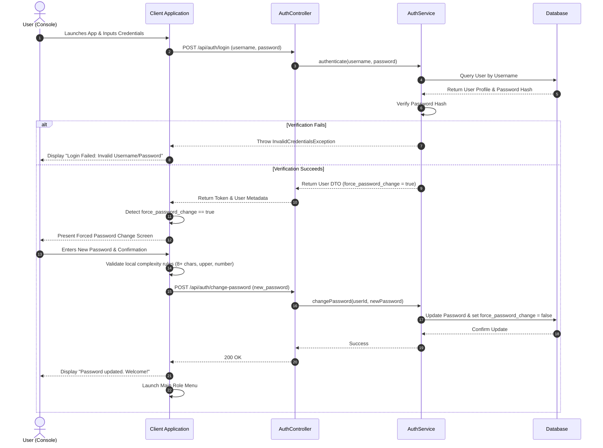
```mermaid
sequenceDiagram
    autonumber
    actor User as User (Console)
    participant Client as Client Application
    participant AuthC as AuthController
    participant AuthS as AuthService
    participant DB as Database

    User->>Client: Launches App & Inputs Credentials
    Client->>AuthC: POST /api/auth/login (username, password)
    AuthC->>AuthS: authenticate(username, password)
    AuthS->>DB: Query User by Username
    DB-->>AuthS: Return User Profile & Password Hash
    AuthS->>AuthS: Verify Password Hash
    
    alt Verification Fails
        AuthS-->>Client: Throw InvalidCredentialsException
        Client-->>User: Display "Login Failed: Invalid Username/Password"
    else Verification Succeeds
        AuthS-->>AuthC: Return User DTO (force_password_change = true)
        AuthC-->>Client: Return Token & User Metadata
        Client->>Client: Detect force_password_change == true
        Client-->>User: Present Forced Password Change Screen
        
        User->>Client: Enters New Password & Confirmation
        Client->>Client: Validate local complexity rules (8+ chars, upper, number)
        Client->>AuthC: POST /api/auth/change-password (new_password)
        AuthC->>AuthS: changePassword(userId, newPassword)
        AuthS->>DB: Update Password & set force_password_change = false
        DB-->>AuthS: Confirm Update
        AuthS-->>AuthC: Success
        AuthC-->>Client: 200 OK
        Client-->>User: Display "Password updated. Welcome!"
        Client->>Client: Launch Main Role Menu
    end
```

---

### 5.2. AI-Assisted Skill Match & Resource Allocation Sequence
Detailed interaction for matching candidates via LLM API integration and confirming allocation constraints.

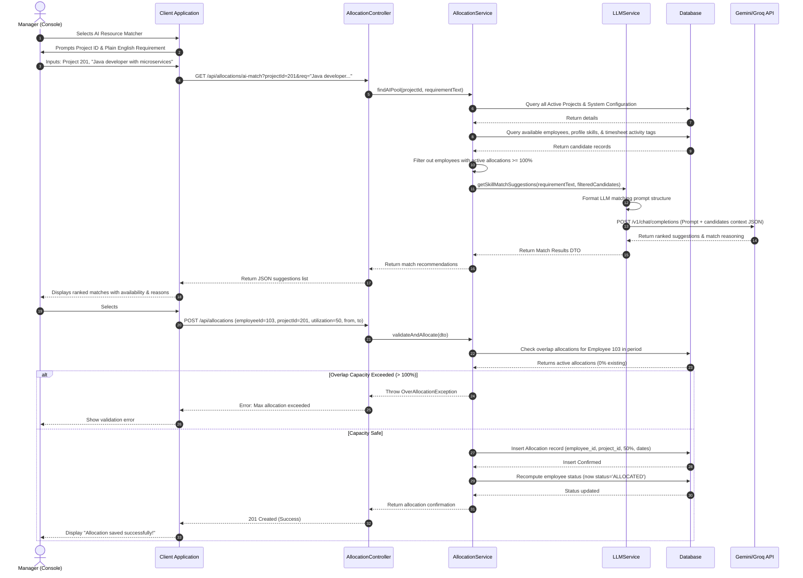
```mermaid
sequenceDiagram
    autonumber
    actor Mgr as Manager (Console)
    participant Client as Client Application
    participant AllocC as AllocationController
    participant AllocS as AllocationService
    participant LLMS as LLMService
    participant DB as Database
    participant Gemini as Gemini/Groq API

    Mgr->>Client: Selects AI Resource Matcher
    Client->>Mgr: Prompts Project ID & Plain English Requirement
    Mgr->>Client: Inputs: Project 201, "Java developer with microservices"
    
    Client->>AllocC: GET /api/allocations/ai-match?projectId=201&req="Java developer..."
    AllocC->>AllocS: findAIPool(projectId, requirementText)
    
    AllocS->>DB: Query all Active Projects & System Configuration
    DB-->>AllocS: Return details
    AllocS->>DB: Query available employees, profile skills, & timesheet activity tags
    DB-->>AllocS: Return candidate records
    
    AllocS->>AllocS: Filter out employees with active allocations >= 100%
    AllocS->>LLMS: getSkillMatchSuggestions(requirementText, filteredCandidates)
    
    LLMS->>LLMS: Format LLM matching prompt structure
    LLMS->>Gemini: POST /v1/chat/completions (Prompt + candidates context JSON)
    Gemini-->>LLMS: Return ranked suggestions & match reasoning
    LLMS-->>AllocS: Return Match Results DTO
    AllocS-->>AllocC: Return match recommendations
    AllocC-->>Client: Return JSON suggestions list
    Client-->>Mgr: Displays ranked matches with availability & reasons
    
    Mgr->>Client: Selects #1 (Anil Mehta), sets 50% allocation & dates (Jun-Sep)
    Client->>AllocC: POST /api/allocations (employeeId=103, projectId=201, utilization=50, from, to)
    AllocC->>AllocS: validateAndAllocate(dto)
    
    AllocS->>DB: Check overlap allocations for Employee 103 in period
    DB-->>AllocS: Returns active allocations (0% existing)
    
    alt Overlap Capacity Exceeded (> 100%)
        AllocS-->>AllocC: Throw OverAllocationException
        AllocC-->>Client: Error: Max allocation exceeded
        Client-->>Mgr: Show validation error
    else Capacity Safe
        AllocS->>DB: Insert Allocation record (employee_id, project_id, 50%, dates)
        DB-->>AllocS: Insert Confirmed
        AllocS->>DB: Recompute employee status (now status='ALLOCATED')
        DB-->>AllocS: Status updated
        AllocS-->>AllocC: Return allocation confirmation
        AllocC-->>Client: 201 Created (Success)
        Client-->>Mgr: Display "Allocation saved successfully!"
    end
```

---

### 5.3. Timesheet Submission & Constraint Validation Sequence
Details the validation layers ensuring hours do not exceed project-specific utilization rules or company-wide ceilings.

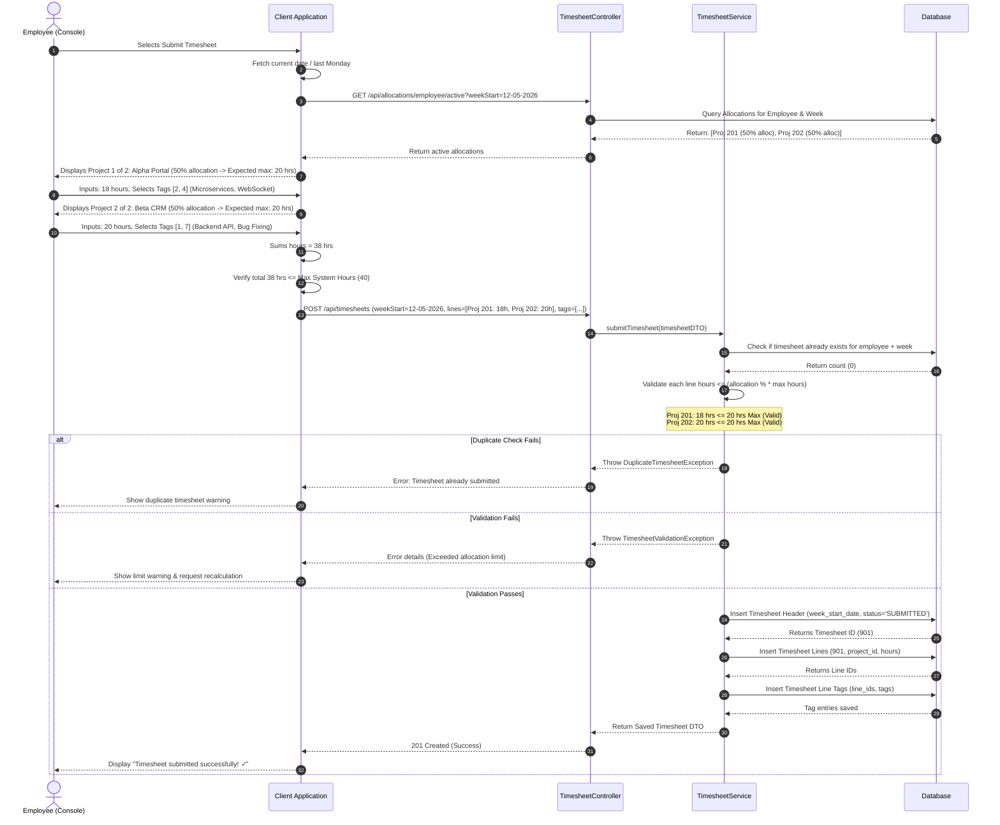
```mermaid
sequenceDiagram
    autonumber
    actor Emp as Employee (Console)
    participant Client as Client Application
    participant TSC as TimesheetController
    participant TSS as TimesheetService
    participant DB as Database

    Emp->>Client: Selects Submit Timesheet
    Client->>Client: Fetch current date / last Monday
    Client->>TSC: GET /api/allocations/employee/active?weekStart=12-05-2026
    TSC->>DB: Query Allocations for Employee & Week
    DB-->>TSC: Return: [Proj 201 (50% alloc), Proj 202 (50% alloc)]
    TSC-->>Client: Return active allocations
    
    Client-->>Emp: Displays Project 1 of 2: Alpha Portal (50% allocation -> Expected max: 20 hrs)
    Emp->>Client: Inputs: 18 hours, Selects Tags [2, 4] (Microservices, WebSocket)
    
    Client-->>Emp: Displays Project 2 of 2: Beta CRM (50% allocation -> Expected max: 20 hrs)
    Emp->>Client: Inputs: 20 hours, Selects Tags [1, 7] (Backend API, Bug Fixing)
    
    Client->>Client: Sums hours = 38 hrs
    Client->>Client: Verify total 38 hrs <= Max System Hours (40)
    
    Client->>TSC: POST /api/timesheets (weekStart=12-05-2026, lines=[Proj 201: 18h, Proj 202: 20h], tags=[...])
    TSC->>TSS: submitTimesheet(timesheetDTO)
    
    TSS->>DB: Check if timesheet already exists for employee + week
    DB-->>TSS: Return count (0)
    
    TSS->>TSS: Validate each line hours <= (allocation % * max hours)
    Note over TSS: Proj 201: 18 hrs <= 20 hrs Max (Valid)<br/>Proj 202: 20 hrs <= 20 hrs Max (Valid)
    
    alt Duplicate Check Fails
        TSS-->>TSC: Throw DuplicateTimesheetException
        TSC-->>Client: Error: Timesheet already submitted
        Client-->>Emp: Show duplicate timesheet warning
    else Validation Fails
        TSS-->>TSC: Throw TimesheetValidationException
        TSC-->>Client: Error details (Exceeded allocation limit)
        Client-->>Emp: Show limit warning & request recalculation
    else Validation Passes
        TSS->>DB: Insert Timesheet Header (week_start_date, status='SUBMITTED')
        DB-->>TSS: Returns Timesheet ID (901)
        TSS->>DB: Insert Timesheet Lines (901, project_id, hours)
        DB-->>TSS: Returns Line IDs
        TSS->>DB: Insert Timesheet Line Tags (line_ids, tags)
        DB-->>TSS: Tag entries saved
        TSS-->>TSC: Return Saved Timesheet DTO
        TSC-->>Client: 201 Created (Success)
        Client-->>Emp: Display "Timesheet submitted successfully! ✓"
    end
```

---

### 5.4. Project Risk Summary Generation Sequence
Illustrates how client commands trigger risk scans, data collation, and call external LLM models for natural language diagnostics.

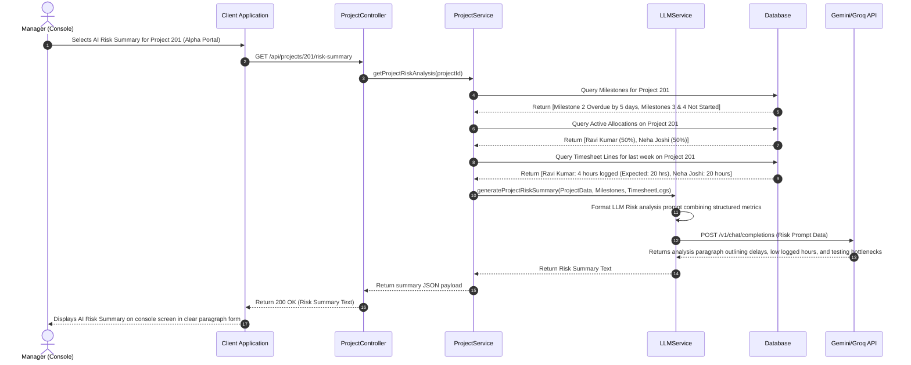
```mermaid
sequenceDiagram
    autonumber
    actor Mgr as Manager (Console)
    participant Client as Client Application
    participant ProjC as ProjectController
    participant ProjS as ProjectService
    participant LLMS as LLMService
    participant DB as Database
    participant Gemini as Gemini/Groq API

    Mgr->>Client: Selects AI Risk Summary for Project 201 (Alpha Portal)
    Client->>ProjC: GET /api/projects/201/risk-summary
    ProjC->>ProjS: getProjectRiskAnalysis(projectId)
    
    ProjS->>DB: Query Milestones for Project 201
    DB-->>ProjS: Return [Milestone 2 Overdue by 5 days, Milestones 3 & 4 Not Started]
    
    ProjS->>DB: Query Active Allocations on Project 201
    DB-->>ProjS: Return [Ravi Kumar (50%), Neha Joshi (50%)]
    
    ProjS->>DB: Query Timesheet Lines for last week on Project 201
    DB-->>ProjS: Return [Ravi Kumar: 4 hours logged (Expected: 20 hrs), Neha Joshi: 20 hours]
    
    ProjS->>LLMS: generateProjectRiskSummary(ProjectData, Milestones, TimesheetLogs)
    LLMS->>LLMS: Format LLM Risk analysis prompt combining structured metrics
    LLMS->>Gemini: POST /v1/chat/completions (Risk Prompt Data)
    Gemini-->>LLMS: Returns analysis paragraph outlining delays, low logged hours, and testing bottlenecks
    LLMS-->>ProjS: Return Risk Summary Text
    ProjS-->>ProjC: Return summary JSON payload
    ProjC-->>Client: Return 200 OK (Risk Summary Text)
    Client-->>Mgr: Displays AI Risk Summary on console screen in clear paragraph form
```
